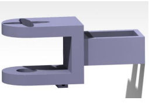

# Snake Robot Project

## Overview
This project focuses on the design, development, and automation of a snake-like robot, known as a "snakebot." The primary objective of the snakebot is to serve in critical missions, such as search and rescue operations, where its unique ability to navigate through challenging and confined environments provides significant advantages over traditional robots.

## Design calculation

To make the realization of the robot possible, a crucial step is the sizing calculation of the motors. Choosing the right motor is essential to ensure reliable, efficient, optimal, and most importantly, safe operation of the system. In this snakebot robot, the following forces act:

- Normal force (N)
- Weight force (G, Gx, Gy), where Gx and Gy are the projections of force G on the OX and OY axes
- Friction force (Ff)
- Traction force (Ft)
- Inertia force (Fi)


### Input data

| Input parameters | Parameter values | Unit of measure |
| --- | --- | --- |
| m | 0.6 | [kg] |
| r | 0.14 | [m] |
| g | 9.81 | [m/s²] |
| α | 15º | |
| µ | 0.01 | |

Where:
- m represents the mass of the snakebot
- r represents the distance from the center of rotation of the joint to the next segment
- α represents the angle of inclination
- g represents the gravitational acceleration

Starting from these input data, we can begin determining the forces that occur within the robot and the actual selection of the motor suitable for our application. Determination of the weight force:

### Determination of the Weight Force

\[ G = m \cdot g \Rightarrow G = 0.6 \cdot 9.81 \Rightarrow G = 5.886 \, [N] \]

Where:
- \( m \) - mass of the snakebot
- \( g \) - gravitational acceleration

Considering that we are on an inclined plane, the force \( G \) will be decomposed into the two axes \( Ox \) and \( Oy \), respectively \( Gx \) and \( Gy \):

\[ G_y = G \cdot \cos(\alpha) \Rightarrow G_y = 5.886 \cdot 0.96 \Rightarrow G_y = 5.68 \, [N] \]

\[ G_x = G \cdot \sin(\alpha) \Rightarrow G_x = 5.886 \cdot 0.258 \Rightarrow G_x = 1.52 \, [N] \]

Where:
- \( Gx \) and \( Gy \) - projections of force \( G \) on \( Ox \) and \( Oy \)
- \( \cos(\alpha) \) and \( \sin(\alpha) \) - cosine and sine of the angle that generates the inclined plane of 15º

Another force acting on the robot is the normal force to the surface, equal and opposite to \( Gy \):

\[ N = Gy \Rightarrow N = 5.886 \, [N] \]

### Determination of the Friction Force

\[ Ff = \mu \cdot N \Rightarrow Ff = 0.01 \cdot 5.886 \Rightarrow Ff = 0.05886 \, [N] \]

Where:
- \( \mu \) - coefficient of friction
- \( N \) - normal force to the surface

For a snakebot robot, I adopt a small acceleration value of 0.3 m/s², as it ensures smooth and natural movements, improving stability and precision, reducing component wear and energy consumption.

Thus, \( a = 0.3 \, m/s² \).

### Determination of the Inertia Force

\[ Fi = m \cdot a \Rightarrow Fi = 0.6 \cdot 0.3 \Rightarrow Fi = 0.18 \, [N] \]

Where:
- \( m \) - mass of the snakebot
- \( a \) - acceleration of 0.3 m/s²

### Determination of the Traction Force

The traction force is equal to the sum of the forces calculated above:

\[ Ft = Fi + Ff + Gx \Rightarrow Ft = 0.18 + 0.05886 + 1.52 \Rightarrow Ft = 1.75 \, [N] \]

### Determination of the Resistant Moment

\[ M_{rezistent} = Ft \cdot r \Rightarrow M_{rezistent} = 1.75 \cdot 0.12 \Rightarrow M_{rezistent} = 0.21 \, [N \cdot m] \]

Where:
- \( Ft \) - traction force
- \( r \) - distance from the center of rotation of the joint to the next segment

### Determination of the Angular Velocity

\[ \omega = \frac{v}{r} \Rightarrow \omega = \frac{0.73}{0.12} \Rightarrow \omega = 6.08 \, [rad/s] \]

Where:
- \( v \) - velocity
- \( r \) - distance from the center of rotation of the joint to the next segment

### Determination of the Efficiency

\[ n = \frac{\omega \cdot 60}{2\pi} \Rightarrow n = \frac{6.08 \cdot 30}{\pi} \Rightarrow n = 58.12 \, [rot/min] \]

### Determination of the Mechanical Power

\[ P_m = M \cdot \omega \Rightarrow P_m = 0.21 \cdot 6.08 \Rightarrow P_m = 1.27 \, [W] \]


## Selection of the Servomotor

Based on the results determined through the sizing calculations, we chose the MG996R servomotor, a servomotor with a limited rotation range (0-180°), controlled by PWM (Pulse Width Modulation) signals. 

We selected this servomotor following the calculations made, which are compatible with its characteristics.


Table 2. Specifications of the MG996R Servomotor

| Specification       | Value                              |
|---------------------|------------------------------------|
| Weight              | 55g                                |
| Dimensions          | 40.7 x 19.7 x 42.9 mm approx.      |
| Maximum Torque      | 4.8V: 9.4 kg·cm (0.92 N·m)         |
|                     | 6.0V: 11 kg·cm (1.08 N·m)          |
| Rotation Angle      | 0° - 180°                          |
| Stall Current       | 2.5 A                              |
| Connectors          | 3 pins (signal, VCC, GND)          |

## CAD Modeling and Subassembly Presentation

This chapter details the 3D modeling of a snakebot, a modular robot consisting of six articulable segments, each equipped with a servomotor. Each segment is designed to ensure autonomous movement and precision, integrating a servomotor mounted on a guide plate and supported by a bearing.


Each segment is designed to ensure autonomous movement and precision, integrating a servomotor mounted on a guide plate and supported by a bearing. This assembly allows for smooth and controlled rotation, crucial for the maneuverability of each segment.

The bracket of each servomotor is designed to facilitate precise alignment and efficient mounting, with a special cutout that allows the insertion of the servomotor terminal. This feature is vital for the integration and mechanical stability of the snakebot, allowing each segment to move independently or in coordination with the others, depending on the received command.


Mobility is enhanced by the sets of wheels attached to each segment, allowing the snakebot to move on various types of surfaces, from smooth to low-traction ones. These wheels are essential for the robot's adaptability in varied terrains, whether it is indoor or outdoor exploration.


The head of the snakebot is equipped with a Raspberry Pi and an Adafruit module, which together form the robot's command center. The Raspberry Pi processes input data and sends commands to the servomotors through an efficient communication network.


This includes commands for adjusting the position and speed of each servomotor, allowing the snakebot to perform complex movements, such as slithering or achieving precise angles for navigation or manipulation.

This sensor measures the distance to nearby objects, sending data to the Raspberry Pi, which adjusts the snakebot's trajectory to avoid collisions. This detection and adaptation capability is crucial in unknown environments or in conditions of limited visibility.


### Subassembly Components

Table 4.1 Component Table

| No. | Component Name       | 3D Model                |
|-----|----------------------|-------------------------|
| 1   | Head Casing          |  |
| 2   | Ultrasonic Sensor HC-SR04 |   |
| 3   | Raspberry Pi 4 Model B |   |
| 4   | Adafruit PCA9685     |   |
| 5   | M3 Screw             |   |
| 6   | Head Mount           |   |
| 7   | Servomotor           |   |
| 8   | Coupling             |   |
| 9   | Mount                |   |
| 10  | Bearing              |  |
| 11  | Guide Plate          |  |
| 12  | Wheel                |  |
| 13  | Shatf                |  |
| 14  | Bearing cap          |  |
| 15  | M3 Screw             |  |

## Automation of the Snake Robot Control System

In this chapter, we will explore in detail the integration of the essential hardware and software components for controlling a snake robot. We will use the Raspberry Pi 4 Model B as the central control unit, a PCA9685 PWM driver for managing the servomotors, and an HC-SR04 ultrasonic sensor for obstacle detection.

Electrical schematic of the snakebot operation:


### Connection between Raspberry Pi and PCA9685

- Pin 1 on the Raspberry Pi (3.3V) should be connected to the VCC pin on the PCA9685 to provide the necessary voltage for operating the internal electronic components of the driver. This 3.3V power supply is crucial for the proper functioning of the PCA9685's internal circuits.
- Pin 3 (GPIO2, SDA) on the Raspberry Pi connects to the SDA pin on the PCA9685, allowing data transfer between the Raspberry Pi and PCA9685 via the serial data line (SDA). This line is used to send and receive data necessary for precise control of the servomotors using the I2C protocol. The I2C protocol is a bidirectional communication standard where data is synchronized with the clock signal generated on the SCL line.
- Pin 5 (GPIO3, SCL) on the Raspberry Pi should be connected to the SCL pin on the PCA9685. The serial clock line (SCL) synchronizes data transfer on the SDA line, dictating when data is read or written, thus ensuring proper synchronization of all communications between the Raspberry Pi and PCA9685.
- Finally, Pin 6 (GND) on the Raspberry Pi should be connected to the GND pin on the PCA9685 to establish a common voltage reference. This ground connection is essential for ensuring a common voltage reference among all system components, preventing electrical fluctuations and interference that could affect the system's performance and stability.

By ensuring these connections, efficient and stable operation of the servomotor control system is guaranteed, facilitating precise communication and synchronization of the necessary data.

### Connection between Raspberry Pi and Ultrasonic Sensor HC-SR04

Pin 2 (5V) is connected to VCC on the HC-SR04 to provide the necessary 5V power supply, ensuring the proper operation of the sensor.
Pin 9 (GND) is connected to GND on the HC-SR04 to complete the circuit and provide a common voltage reference for all components.
Pin 10 (GPIO15) is connected to the TRIG pin on the HC-SR04, used to send control pulses that initiate the distance measurement by sending a 10-microsecond pulse.
Pin 8 (GPIO14) is connected to the ECHO pin on the HC-SR04 through a voltage divider, as the ECHO signal sends a 5V signal that needs to be reduced to 3.3V to protect the GPIO pins of the Raspberry Pi. These connections ensure the correct and protected operation of the HC-SR04 sensor within the system.

#### Voltage Divider for the ECHO Pin

To protect the GPIO pins of the Raspberry Pi, which operate at 3.3V, from the 5V signal of the ECHO pin of the HC-SR04 sensor, it is necessary to use a voltage divider. A voltage divider is a simple circuit that reduces the input voltage to a lower value using two resistors. We will detail the necessary calculation for choosing the resistors in this voltage divider.

A voltage divider consists of two resistors connected in series. The output voltage is taken from the common point between the two resistors.

Voltage Divider Formula:


Where:
- \( V_{in} \) is the input voltage (5V from ECHO)
- \( V_{out} \) is the desired output voltage (3.3V for GPIO)
- \( R1 \) is the resistor connected to the input voltage
- \( R2 \) is the resistor connected to GND

We want to reduce the voltage from 5V to 3.3V. Using the voltage divider formula, we can calculate the resistor values.

Given:
- \( V_{in} = 5V \)
- \( V_{out} = 3.3V \)
- \( R2 = 2kΩ \)

We find \( R1 \):


These values will ensure the reduction of the voltage from 5V to approximately 3.3V, thus protecting the GPIO pins of the Raspberry Pi.

## Snakebot Automation Code

In this subchapter, I will present the code used to move the snakebot, using a Raspberry Pi and a PCA9685 driver for the servomotors, present in `snakebot.py` file. The robot has an HC-SR04 ultrasonic sensor that can detect obstacles. The code starts the ultrasonic sensor and the servomotor control system, determines the distance to obstacles, and adjusts the robot's movements to prevent collisions.

To mimic snake locomotion, the robot adapts in real-time to its surroundings through sinusoidal movements. The code is structured to allow the robot to move continuously and independently. It has specific capabilities to measure distance, avoid obstacles, and produce specific undulating movements.

### Code Explanation

The libraries used in this code include `RPi.GPIO` for controlling the GPIO pins on the Raspberry Pi, `time` for time-related functions, and `adafruit_servokit` for controlling the PCA9685 driver.

The code sets the GPIO mode to BCM, defines and configures the GPIO pins for the HC-SR04 ultrasonic sensor, initializes the PCA9685 for controlling the servomotors, and sets the initial angle of all servomotors to 90 degrees.

The code sends a 10µs pulse on the TRIG pin, measures the time until the signal on the ECHO pin goes HIGH and then LOW, and calculates the time difference and distance based on the speed of sound.

The code stops the servomotor movement by setting all angles to 90 degrees, performs an avoidance maneuver by rotating to 45 degrees, and resets the angles to the initial position after avoiding the obstacle.

The code performs the undulating movement of the snake robot, checking the distance at each iteration to avoid obstacles if the distance is less than 10 cm, and alternating the servomotor angles to create a wave effect.

The code runs the `ondulare()` function in an infinite loop and, upon program interruption (KeyboardInterrupt), resets the servomotors to 90 degrees and cleans up the GPIO configuration.

Here are the commands needed before you run the code on your Raspberry PI:
```cmd
python3 -m venv .venv
source .venv/bin/activate
pip install -r requirements.txt
```